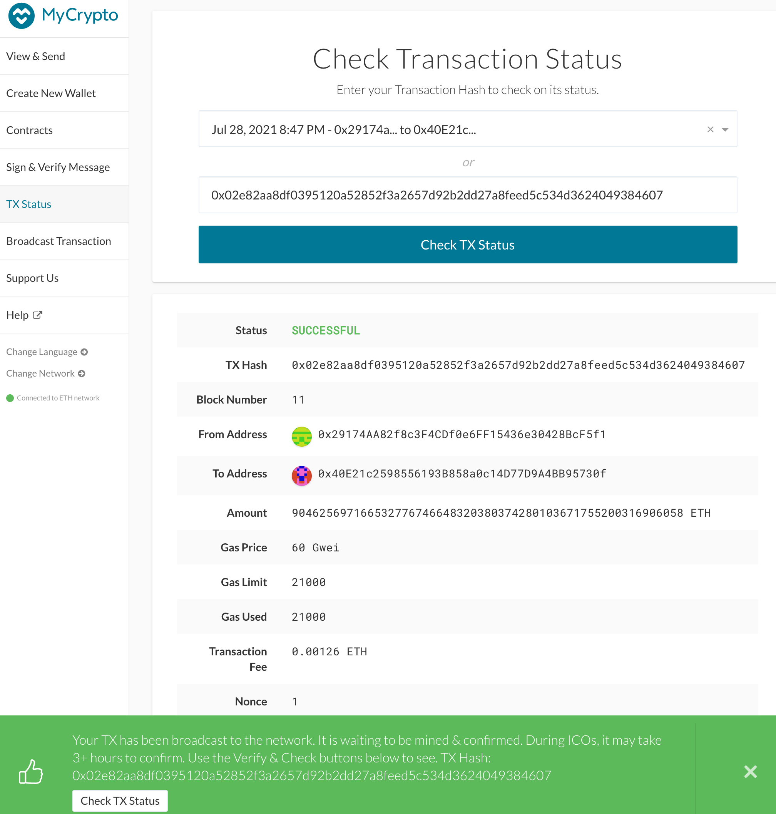

### Infos of the network lucca
- Chain ID: 37289
- Nodes keystore password: lucca123
- Screenshot of 
- Screenshot of 
How to set up a test net

1. First of all, it is needed to set up your computer by downloading the [Go Ethereum (GETH) files](https://geth.ethereum.org/downloads/)

2. Set up account for at least two nodes by using the following commands:
- `./geth account new --datadir *yournodename*`
- create and confirm a password to be used later on to restore the keystore file
- repeat the process again to create another node

3. Initialize the network using CLI
- enter `./puppeth`
- create a name for your network

4. Configuration
- Select 2 (Configure new Genesis)
- Select 1 (Create new Genesis from scratch)
- Select 2 (Clique - proof of authority) as the consensus engine
- Click enter to use the default blocktime of 15 seconds
- Select the accounts that are allowed to seal the blocks. For that, use the information provided on Step 2 - you may use the address of one or all of your nodes
- Select which accounts should be pre funded
- Select 2 (Manage existing genesis)
- Select 2 (Export genesis configuration)
- Choose the folder to save the files. If click enter, the current folder will be used
- Exit puppeth by clicking Ctrl + C

***alternatively, you can download the `lucca.json` file in this repo instead of creating a new network. Note that the name of this network is Lucca. Chain ID is 37289***

5. Initiatlization of Nodes
- use the command `/geth init yournetworkname.json --datadir *yournodename*` on all your nodes
- run the nodes in separate terminal windows with the following commands:
`./geth --datadir yournodename --unlock "SEALER_ONE_ADDRESS" --mine --rpc --allow-insecure-unlock`
`./geth --datadir yournodename --unlock "SEALER_TWO_ADDRESS" --mine --port 30304 --bootnodes "enode://SEALER_ONE_ENODE_ADDRESS@127.0.0.1:30303" --ipcdisable --allow-insecure-unlock`

5.

1. Dependencies
This assignment uses Go Ethereum (GETH) as a test net. It is needed to download the files and set up properly.

2. Creation of nodes
When 
