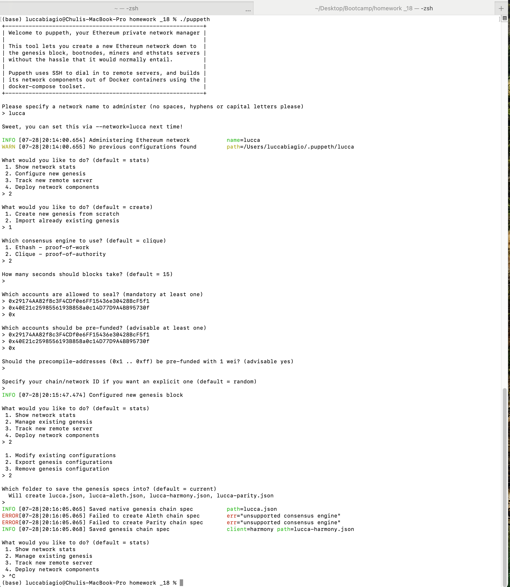

# 
Create a README.md in your project directory and create documentation that explains how to start the network.
Remember to include any environment setup instructions and dependencies.
Be sure to include all of the geth flags required to get both nodes to mine and explain what they mean.
Explain the configuration of the network, such as it's blocktime, chain ID, account passwords, ports, etc.
Explain how to connect MyCrypto to your network and demonstrate (via screenshots and steps) and send a transaction.

1. Dependencies
This assignment uses Go Ethereum (GETH) as a test net. It is needed to download the files and set up properly.

2. Creation of nodes
When 
